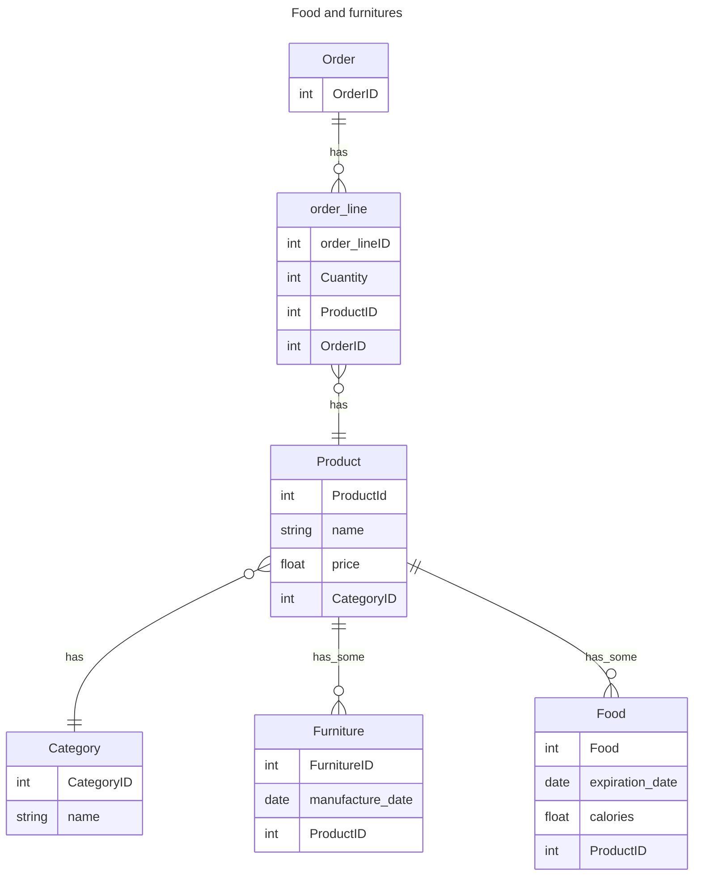

Realizar una base de datos relacional de la imagen adjuntada a continuación, en el cuál aplique los conceptos aprendidos durante la clase sobre **Lenguaje de manipulación de datos** (DML) y  **Lenguaje de definición de datos** (DDL).
En cuál se le solicita:  
1. Realizar el diagrama entidad relación.
2. Realizar la base de datos de videojuegos.
3. Realizar el proceso de DML y DDL en la base de datos.

### Diagrama de relación de entidades base de datos **food_and_furniture**

