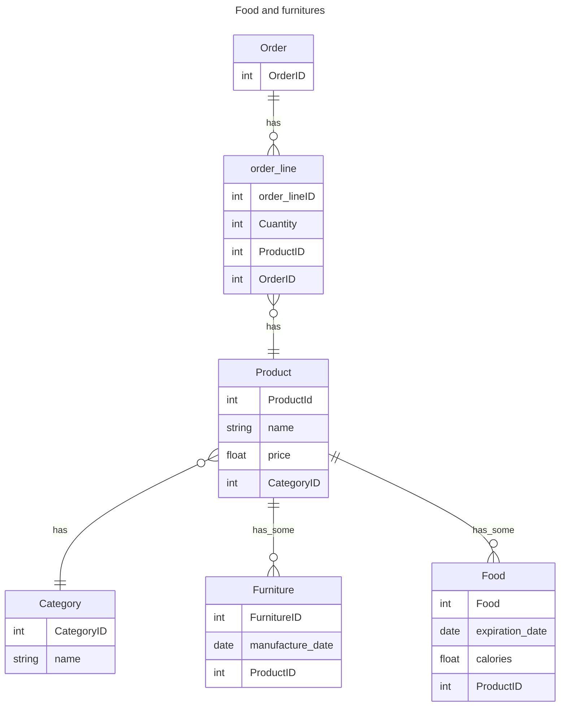
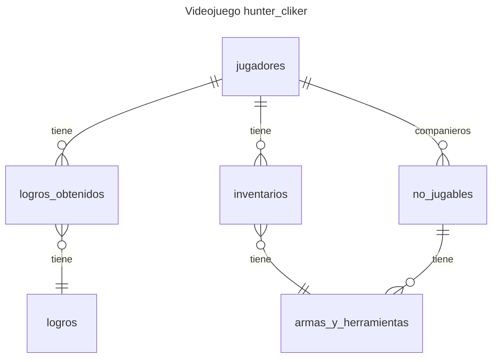

Realizar una base de datos relacional de la imagen adjuntada a continuación, en el cuál aplique los conceptos aprendidos durante la clase sobre **Lenguaje de manipulación de datos** (DML) y  **Lenguaje de definición de datos** (DDL).
En cuál se le solicita:  
1. Realizar el diagrama entidad relación.
2. Realizar la base de datos de videojuegos.
3. Realizar el proceso de DML y DDL en la base de datos.

## Diagrama de relación de entidades base de datos `food_and_furniture`



Se le solicita:  
1. Realizar el diagrama entidad relación.
2. Realizar la base de datos de videojuegos.
3. Realizar el proceso de DML y DDL en la base de datos.

## Base de datos `hunter_cliker`

#### Diagrama entidad relación


#### Procesos DML utilizados:
`INSERT`: Al insertar datos en las distintas tablas
```sql
INSERT INTO hunter_cliker.`logros`(`nombre_del_logro`,`experiencia`) VALUES
	("Consigue tu primera arma", 20),
	("Derrota tu primer enemigo", 50),
	("Abrir el inventario", NULL),
	("Primer nivel desbloqueado", 100);
```

`SELECT`: Al inspeccionar las tablas y columnas
```sql
SELECT jugador_id FROM hunter_clicker.jugadores ;
```
#### Procesos DDL utilizados:
Uso del `CREATE`  en:
1. La creación de la base de datos
```sql
CREATE DATABASE `hunter_clicker` ;
```

2. La creación de tablas
```sql
CREATE TABLE hunter_clicker.`jugadores` (
	`jugador_id` INT NOT NULL AUTO_INCREMENT,
	PRIMARY KEY (`jugador_id`)
) ;
```

